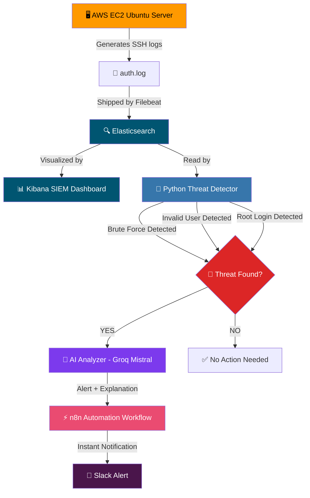
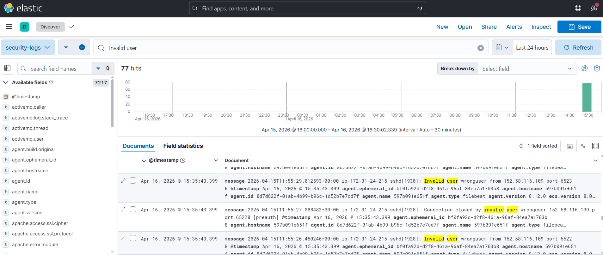
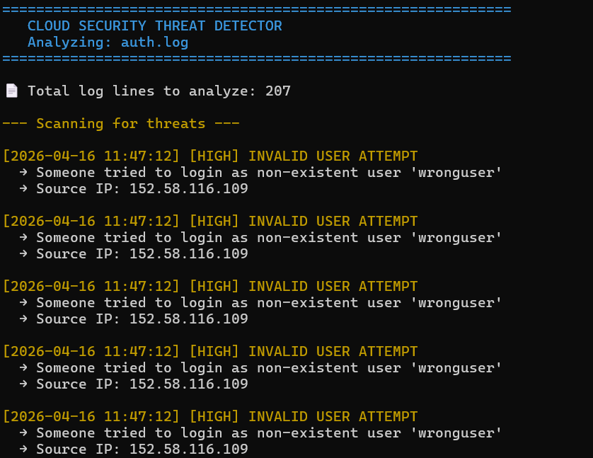
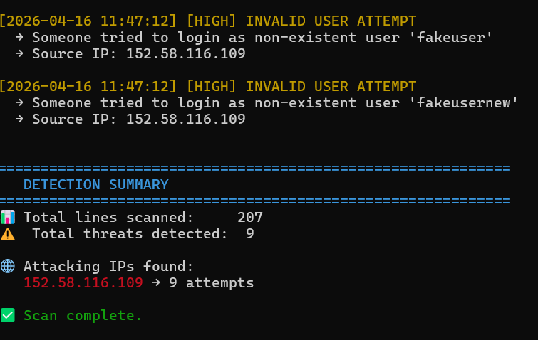
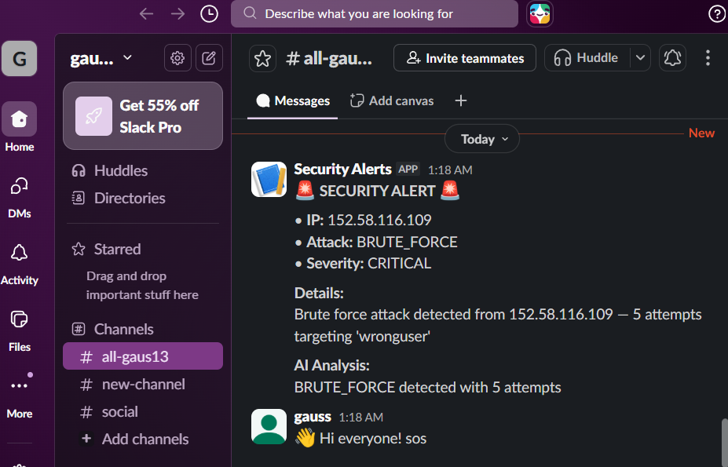

# Cloud-Security-Monitoring

# 🔐 Cloud Security Monitoring + AI Alert System

A real-world cloud security monitoring system that automatically detects threats,
analyzes them using AI, and sends instant alerts via Slack — built to simulate
how modern SOC teams operate. 

---
## 🏗️ Architecture



## 📌 Phases

| Phase | Description | Status |
|-------|-------------|--------|
| Phase 1 | AWS Setup (EC2 + CloudTrail) | ✅ Complete |
| Phase 2 | ELK Stack SIEM Setup | ✅ Complete  |
| Phase 3 | Threat Detection (Python) | ✅ Complete  |
| Phase 4 | AI Alert Analysis (Claude API) | ✅ Complete  |
| Phase 5 | Automation with n8n | ✅ Complete |
| Phase 6 | Slack Notifications | ✅ Complete |

---

## 🛠️ Tech Stack

- **AWS** — EC2, CloudTrail, S3, IAM
- **ELK Stack** — Elasticsearch, Kibana, Filebeat
- **Python** — Threat detection logic
- **Claude API** — AI-powered alert explanation
- **n8n** — Workflow automation
- **Slack** — Real-time alerting
- **Docker** — Container orchestration
## 📸 Screenshots

### 🔍 Kibana Logs


### 🚨 Detection Alerts



### 📩 Slack Alert Integration

---

---

## 🚀 How to Run This Project


### Prerequisites
- AWS Account (free tier)
- Docker Desktop
- Python 3.x
- Groq API key (free)
- Slack workspace

### 1. Clone the repo
```bash
git clone https://github.com/gaus13/Cloud-Security-Monitoring.git
cd Cloud-Security-Monitoring
```

### 2. Setup virtual environment
```bash
python3 -m venv venv
source venv/bin/activate
pip install requests python-dotenv colorama python-dateutil
```

### 3. Create .env file
```bash
cp .env.example .env
# Add your API keys to .env
```

### 4. Start ELK Stack
```bash
cd phase2-elk-stack
docker compose up -d
```

### 5. Run threat detection
```bash
python3 phase3-detection/detector.py
```

### 6. Run AI analyzer
```bash
python3 phase4-ai-analysis/ai_analyzer.py
```

### 7. Start n8n automation
```bash
docker run -d --name n8n -p 5678:5678 n8nio/n8n
# Import workflow from phase5-automation/n8n-workflow.json
```
---

## 👤 Author
Gulam Gaus

